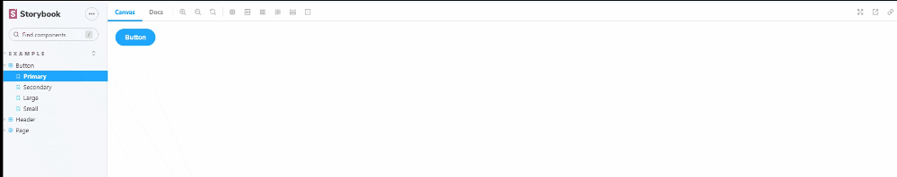

# Storybook FPS-meter Addon

Enable it to display current fps to detect some frame loss



🚧 This addon is experimental and a work in progress. We are not on stable versions yet 🚧

# Angular Router Storybook Addon
[](https://storybook.js.org)
[](https://www.npmjs.com/package/storybook-fps-meter)
[](https://github.com/TekVanDo/storybook-fps/actions/workflows/release.yml)
[](https://www.npmjs.com/package/storybook-fps-meter)

> A simple plugin to make working with the angular router
in storybook easier
### How to use it
Install the addon via npm:
```shell
npm i storybook-fps-meter
```
Add it to your storybook configuration:
```js
// .storybook/main.js
module.exports = {
    addons: ["storybook-fps-meter"],
};
```
